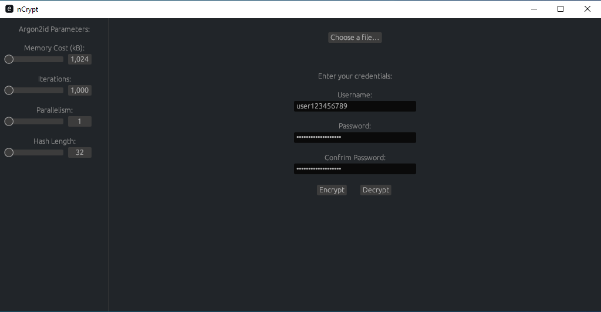

# nCrypt-rs

A simple GUI App to safely encrypt any file





## How it works

Files are encrypted with [AES-GCM](https://github.com/RustCrypto/AEADs/tree/master/aes-gcm) Authenticated Encryption.

The encryption key is derived from the password hash we generate using the [Argon2id](https://github.com/RustCrypto/password-hashes/blob/master/argon2) hashing alogrithm.

Both salt needed for the `Argon2id` hash and the nonce for the encryption key are derived from the [sha256](https://github.com/RustCrypto/hashes/blob/master/sha2) hash of the username input.

To make sure to be able to decrypt the file using the same credentials the Argon2id parameters are saved at the end of the file as plaintext.

For example if we take a txt file:
```
Some Text
```

It will look like this:
```
qú·²·­ͦ‡´²<­¯}ƒůnnCrypt_Params{"file_name":"C:\\Users\\User\\Desktop\\test.txt","hash_length":64,"m_cost":3200,"p_cost":6,"t_cost":10000}
```

## Build From Source
```
cargo build --bin ncrypt --release
```